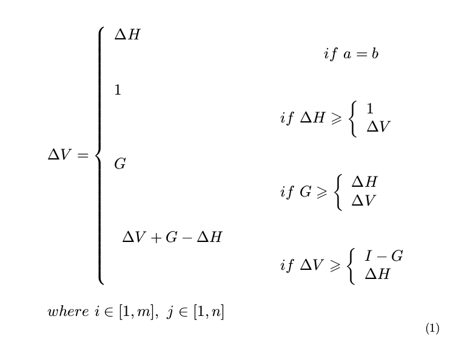

## 公式

<!-- toc -->

### 资源
* [LaTeX技巧10：LaTeX数学公式输入初级入门](http://blog.sina.com.cn/s/blog_5e16f1770100fs38.html)
* [在线公式编辑器](https://www.codecogs.com/latex/eqneditor.php?lang=zh-cn)

### 导入包
```
% 使用resizebox
\usepackage{graphicx}
\usepackage{amsmath}
\usepackage{mathtools}
\usepackage{amssymb }
```

### 基础

数学公式的前后要加上 `$` 或 `\`\( 和 `\`\)，比如：`$f(x) = 3x + 7$` 和 `\(f(x) = 3x + 7\)` 效果是一样的；

如果用 `\[` 和 `\]`，或者使用 `$$` 和 `$$`，则该公式独占一行；

如果用 `\begin{equation}` 和 `\end{equation}`，则公式除了独占一行还会自动被添加序号， 如何公式不想编号则使用 `\begin{equation*}` 和 `\end{equation*}`.

### 字符

普通字符在数学公式中含义一样，除了`# $ % & ~ _ ^ \ { }`若要在数学环境中表示这些符号，需要分别表示为`\# \$ \% \& \_ \{ \}`，即在个字符前加上`\`。

### 上标和下标

用 `^` 来表示上标，用 `_` 来表示下标，看一简单例子：

```C
$$\sum_{i=1}^n a_i=0$$
$$f(x)=x^{x^x}$$
```
### 示例

```c
\begin{equation}\label{eq:v1}
\resizebox{.95\linewidth}{!} {$
\begin{array}{l}
\Delta V = \left\{\begin{array}{l} \Delta H \\
\phantom{\hspace{4.8cm}} if \ a = b \\ \\
 1 \\ 
\phantom{\hspace{3.8cm}} if \ \Delta H \geqslant \left\{\begin{array}{l}
1 \\ \Delta V
\end{array}\right. \\ \\
G \\
\phantom{\hspace{3.8cm}} if \ G \geqslant \left\{\begin{array}{l}
\Delta H \\ \Delta V
\end{array}\right. \\ \\
\begin{array}{l}
\Delta V + G - \Delta H 
\end{array} \\
\phantom{\hspace{3.8cm}} if \ \Delta V \geqslant \left\{\begin{array}{l}
I-G\\ \Delta H
\end{array}\right.
\end{array}\right.
\\ \\
where \ i \in [1,m], \ j \in [1,n]
\end{array}
$}
\end{equation}
```
**效果** 



