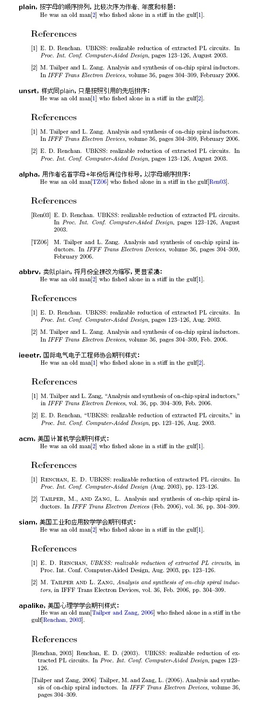

## 使用BibTex数据库管理文献

1. 新建一个后缀为.bib的文件，去谷歌学术或者bing学术搜索文献名，点击`引用`-`BibTex`，将内容复制到 xxx.bib 文件中，格式如下所示

  ```
  @article{needleman1970general, 
  title={A general method applicable to the search for similarities in the amino acid sequence of two proteins},
  author={Needleman, Saul B and Wunsch, Christian D}, 
  journal={Journal of molecular biology}, volume={48}, 
  number={3}, 
  pages={443--453}, 
  year={1970}, 
  publisher={Elsevier} 
  }
  ```

2. 配置latex

  * 设置引用文献类型 - `\bibliographystyle{plain}`
  * 引用文献 - `\cite{needleman1970general}`
  * 在文献结尾处指定BibTex数据库文件，可以不加后缀，在前面加上字体指令`\small`等可以调节引用字体的大小 - `\bibliography{bibfile}`

3. 编译。如果使用TexStudio直接运行即可。如果用命令行，需要按下面方式执行，其中test为你的latex文件

  ```
  xelatex test
  bibtex test
  xelatex test
  xelatex test
  ```


---

附：引用文献样式  



